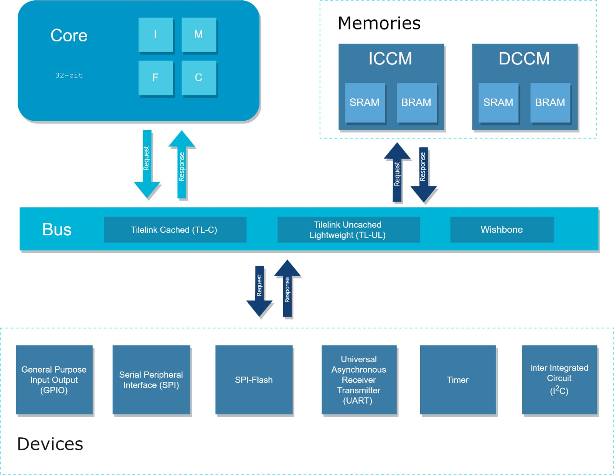

# SoC-Now

## Abstract

 
In the rapidly changing technological world of today, smart phones and other gadgets have taken over our daily lives. Every aspect of life is reliant on technology, or "smart devices." And these devices are called “smart” because they contain a computing system inside called as processor or system on chip (SoC). Development of SoC is a quite long process. It can take months to build and develop a SoC from scratch. Following the design stage, testing, and verification of it adds another layer of stress. Designers like to reuse a verified component in their design to save time. However, this doesn't save time because without adequate documentation, which is lacking in many contributions to open-source projects, it can be extremely challenging to grasp the functionality and usability of a component. The open-source semiconductor industry is therefore in need of software that can quickly produce or design a SoC rather than taking the designer years to complete the build or design. Alternately, any designer can also generate a component with sufficient documentation and plug and play support. SoC-Now is an open-source web-based RISC-V ISA [1][2][3] standardised SoC design solution in terms of generator that enables anyone to create a SoC as shown in Fig.1 with their own customized specifications as shown in Fig.2 and then further process that SoC to the Field Programmable Gate Array (FPGA) Emulation. Additionally, it provides the capability to produce any standalone, verified, and reusable SoC component (Core, Device, Bus) by means of generic interfaces as shown in Fig.3. A completely automated Verification system is also included.

## Features
- This Mini SoC Generator will generate an System on Chip (SoC)
- It will be based on RISC-V ISA (IMFC extensions) (32-bit)
- It will take specifications of the SoC as parameters
- All the Modules will be parametrised and re-usable, for anyone who requires just a single part instead on an entire SoC
- High Level approaches will be used by using CHISEL (Constructing Hardware in Scala Embedded Language)

## Scope
- There will be parameters to select the extensions, which will be included in core.
    - Integer (I) extension will be the base extension
    - Multiplication (M) extension will be optional
    - Floating-Point (F) extension will be optional
    - Compressed (C) extenison will be optional
- There will be parameters to select device(s) as well, to include in the SoC (any one or all can be selected). The list of devices are as follows.
    - GPIO
    - UART
    - SPI
    - SPI-Flash
    - TIMER
    - I2C
- There will be parameters to select Bus Architecture which will be the communication medium within the SoC. The choices for Bus Architecture are:
    - Tilelink Uncached (TL-UL)
    - Wishbone

## Team Members
1. Shahzaib Kashif      (Undergraduate Student, Software Engineering, UITU)
2. Talha Ahmed          (Undergraduate Student, Software Engineering, UITU)
3. Syeda Fizza Jaffery  (Undergraduate Student, Software Engineering, UITU)
4. Almas Ibrahim        (Undergraduate Student, Software Engineering, UITU)
5. Muhammad Shahzaib    (Undergraduate Student, Software Engineering, UITU)
6. Usman Zain           (Graduate Research Associate, Microelectronics Research lab)
7. Hadir Khan           (Graduate Research Associate, Microelectronics Research lab)
8. Farhan Ahmed Karim   (Software Team Lead, Microelectronics Research lab)
